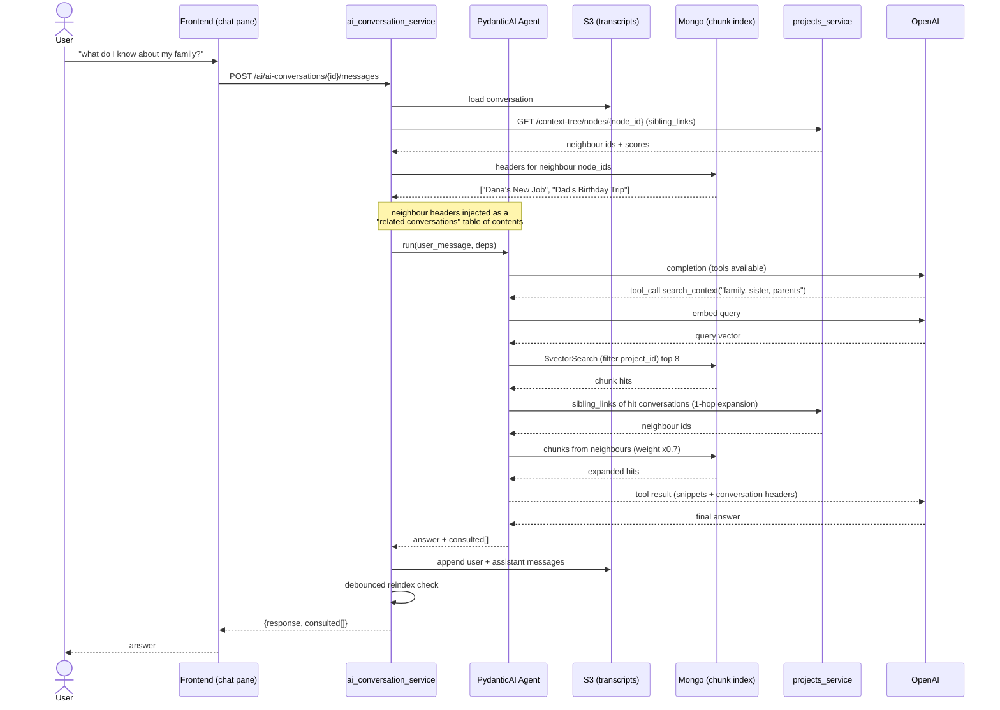
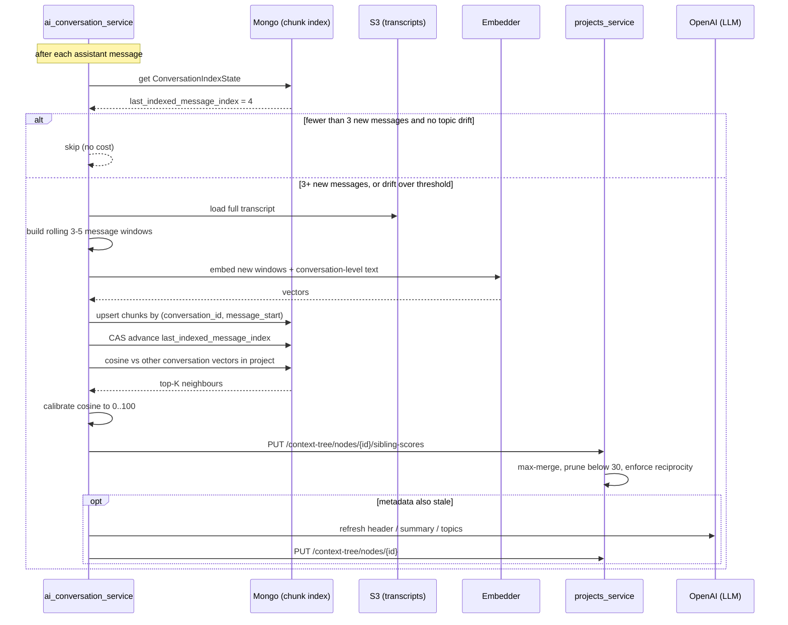

# SDD — Cross-Conversation Context Retrieval

**Status:** Draft
**Location:** `docs/sdd-conversation-context-retrieval.md` (this file — source of truth)
**Author:** Or Keren
**Date:** 2026-07-27

> **Decision record — 2026-07-27, embedding provider.** Probed the project's OpenAI
> key from an Actions runner (`.github/workflows/verify-embeddings-access.yml` on
> `chore/verify-embeddings-access`). Result: the key is scoped to **three chat models
> only** — `gpt-4.1-mini`, `gpt-4.1-nano`, `gpt-5-nano` — and sees **zero embedding
> models**; `/v1/embeddings` returns `403 model_not_found`. Chat works normally.
> Consequence: embeddings are computed **locally, in-process** (ONNX, 384 dims), not
> via OpenAI. The architecture is unchanged — only the `Embedder` implementation,
> vector dimensions, and calibration constants differ. See
> [Embedding provider](#embedding-provider).

## References

- No Jira project for pami — this SDD is the design record.
- Supersedes the retrieval assumptions in `docs/ai-tree-organization.md` and
  `docs/ai-context-tree-integration.md` (both still describe the removed
  `parent_id`/`children_ids` tree model and should be updated or retired).
- Current implementations this changes:
  - `ai_conversation_service/src/ai_conversation_service/services/tree_analysis_service.py`
  - `ai_conversation_service/src/ai_conversation_service/services/ai_conversation_service/service.py`
  - `projects_service/src/projects_service/services/context_tree_service.py`

## Problem Statement

PAMI's value is that conversations accumulate context about a person's world. Today
each conversation is an **island**. Conversations are related to each other only by
`sibling_links` — a similarity score plus a 3-sentence summary — and nothing lets the
assistant actually *use* a neighbouring conversation while answering.

Concretely: a user who discussed their sister in one conversation asks about their
family in another. The assistant has no mechanism to reach the first conversation, so
it answers "I don't have information about your family" despite that information
existing in the same project.

Two structural problems block the fix:

1. **The graph is stale and expensive to refresh.** `_ai_organize_node` runs once, at
   node creation, and sends *every* existing node's header/summary/topics into one
   LLM prompt demanding a score for each. Cost is O(N) tokens per refresh and O(N²)
   over a project's life; latency is 2-5s. A conversation that has grown since
   creation has links describing what it was when it was one message long, and a
   just-started conversation has no useful links at all. Re-running this per message
   is unaffordable in both cost and latency.

2. **Summaries are the wrong retrieval key.** Selecting a conversation to jump to by
   reading its summary is lossy in exactly the direction that matters: "my sister Dana
   is a nurse at Rambam" is the detail a 3-sentence summary drops. It also requires
   the model to read N summaries to choose one, so selection cost grows with the
   project and stops working past a few dozen conversations.

## Goals & Non-Goals

### Goals

1. **The assistant can retrieve context from other conversations in the same project
   while answering**, autonomously deciding when it needs to, and returning evidence
   (actual message text) rather than a summary-based guess.
2. **The correlation graph stays current as conversations grow**, refreshed every few
   messages at a cost and latency that does not grow with project size.
3. **Retrieval is bounded and auditable** — a hard cap on hops, conversations
   consulted, and injected tokens; the set of conversations consulted is recorded on
   every answer.
4. **AI integration moves to PydanticAI** — typed outputs with automatic model
   retries, and tools defined as ordinary async Python functions.

### Non-Goals

- **Entity / fact extraction layer** (deferred to phase 2 — see
  [Phase 2](#phase-2-entity-layer-not-in-this-iteration)). v1 matches on semantic
  similarity, not on named things, and will therefore be fuzzy on questions like
  "who in my family works in healthcare".
- **Cross-project retrieval.** Every query is hard-filtered to one `project_id`.
- **Surfacing traversal in the graph UI.** No `HomePage.js` change to highlight or
  animate traversed nodes; the response carries the data for a later iteration.
- **Making node organization agentic.** `organize-node` keeps its current
  request/response contract; only its internals change.
- **Authentication.** pami has no real auth (`LoginPage` navigates on any input).
  Out of scope here, but see [Security](#security).
- **Replacing S3 as the transcript store.** S3 stays the store of record; Mongo is
  added purely as a search index.
- **Retiring the `sibling_links` graph.** It is kept — as UI and as a traversal
  prior — but it stops being the retrieval index.

## Proposed Solution

### High-Level Architecture

Three changes, in order of importance:

**1. Similarity moves from an LLM to embeddings.** `correlation_score` becomes a
calibrated cosine between conversation-level embedding vectors instead of an LLM
verdict. An embedding pass only ever sees *one conversation's own text*, so cost is
O(1) in project size instead of O(N), and — since embeddings run **locally on CPU**
(see [Embedding provider](#embedding-provider)) — the marginal cost per refresh is
**$0** against ~$0.002 rising to $0.02 today. Latency drops from 2-5s to ~10-30ms.
The N-way comparison afterwards is arithmetic. This is what makes per-few-messages
refresh possible — latency alone ruled it out before. The LLM is retained only for
`header`/`summary`/`topics`, on the same debounce, and can use the cheaper
`gpt-4.1-nano` / `gpt-5-nano` (both available on this key) rather than `gpt-4.1-mini`.

**2. Retrieval happens at message-chunk granularity, exposed as an agent tool.** Each
conversation is additionally indexed as rolling 3-5 message windows. A
`search_context(query)` tool vector-searches those chunks within the project and
returns actual snippets. The `sibling_links` graph is used for **1-hop expansion**:
neighbours of the top hits are pulled in at a reduced weight. Vector search finds
entry points; graph edges expand them.

**3. The chat path becomes a PydanticAI agent.** Tools are async Python functions;
outputs are typed Pydantic models with automatic model retries; the vestigial
`_call_bedrock_ai` branch is removed.

Storage split (decided): **S3 remains the transcript store of record**;
`ai_conversation_service` gains MongoDB purely for two new index collections. Its
existing S3 read/write code is untouched.

Retrieval is **agent-driven, primed by a cheap pre-fetch**: before the agent runs, the
headers of the current node's graph neighbours are injected as a short "related
conversations" table of contents, so the decision to search is informed rather than
blind.

#### Embedding provider

The project's OpenAI key has **no embedding-model access** (see the decision record
above), so embeddings are produced in-process:

- **Primary: `fastembed` with `BAAI/bge-small-en-v1.5`** — 384 dims, ONNX Runtime, no
  PyTorch. ~130MB of dependencies plus a ~130MB model baked into the image at build
  time. CPU inference ~10-30ms per chunk, no network call, no API key, no rate limit,
  $0 marginal cost.
- **Alternative: `sentence-transformers` with `all-MiniLM-L6-v2`** — same 384 dims and
  comparable quality, but pulls in PyTorch (~800MB+ CPU wheel), which is a poor fit
  for a Fargate image. Prefer only if `fastembed` proves unworkable.
- **Deferred alternative: AWS Bedrock Titan Text Embeddings V2**
  (`amazon.titan-embed-text-v2:0`, 1024/512/256 dims) — managed, already inside the
  AWS account, and the service already carries vestigial Bedrock code. AWS Academy
  Learner Labs commonly gate Bedrock model access, so this needs its own probe before
  it can be relied on (Open Question 3).
- **Cheapest possible fix: ask the professor to enable `text-embedding-3-small`.** It
  costs ~$0.02/1M tokens — effectively free at pami's volume — and would remove the
  local model, its image weight, and its memory footprint entirely. Worth asking
  before building; the `Embedder` interface means switching later is a config change,
  not a redesign.

Whichever backend is used, it sits behind one interface so the choice never leaks into
retrieval or scoring code:

```python
class Embedder(Protocol):
    dimensions: int
    model_id: str          # stored on every vector, see ConversationChunk

    async def embed(self, texts: list[str]) -> list[list[float]]: ...
```

#### Flow 1 — answering with traversal



#### Flow 2 — debounced reindex and graph refresh



### Data Models

Two **new** Mongo collections in `ai_conversation_service`. No change to
`ContextTreeNode`, `Project`, or `Task` — `sibling_links` keeps its exact shape, only
the origin of `correlation_score` changes.

```python
# ai_conversation_service/models/conversation_chunk.py
from beanie import Document
from pydantic import Field
from datetime import datetime


class ConversationChunk(Document):
    """A rolling window of messages, embedded for retrieval."""

    conversation_id: str
    node_id: str | None = None          # context node it belongs to, if any
    project_id: str                     # MANDATORY vector-query filter
    text: str                           # the joined 3-5 message window
    message_start: int                  # inclusive index into conversation.messages
    message_end: int                    # inclusive
    embedding: list[float]              # 384 dims (see Scalability)
    embedding_model: str                # e.g. "bge-small-en-v1.5@384"
    created_at: datetime = Field(default_factory=datetime.utcnow)
    updated_at: datetime = Field(default_factory=datetime.utcnow)

    class Settings:
        name = "conversation_chunks"
        indexes = [
            [("conversation_id", 1), ("message_start", 1)],   # upsert key, unique
            [("project_id", 1), ("node_id", 1)],
        ]
```

```python
# ai_conversation_service/models/conversation_index_state.py
class ConversationIndexState(Document):
    """Per-conversation indexing bookkeeping and the conversation-level vector."""

    conversation_id: str                # unique
    node_id: str | None = None
    project_id: str
    header: str | None = None           # denormalized for the neighbour table of contents
    embedding: list[float]              # conversation-level vector (graph scoring)
    embedding_model: str
    last_indexed_message_index: int = -1
    message_count_at_index: int = 0
    last_scored_at: datetime | None = None
    updated_at: datetime = Field(default_factory=datetime.utcnow)

    class Settings:
        name = "conversation_index_state"
        indexes = [
            [("conversation_id", 1)],       # unique
            [("project_id", 1)],
        ]
```

Atlas Vector Search index on `conversation_chunks` (created out-of-band, not by
Beanie):

```json
{
  "fields": [
    { "type": "vector", "path": "embedding", "numDimensions": 384, "similarity": "cosine" },
    { "type": "filter", "path": "project_id" },
    { "type": "filter", "path": "conversation_id" }
  ]
}
```

Cosine-to-score calibration. Raw cosine is **not** uniformly distributed over 0..1,
and — critically — **the distribution is model-specific**, so the constants below are
tied to whichever `Embedder` is configured and must be re-measured if it changes:

**Measured 2026-07-27** on `bge-small-en-v1.5@384` (quantized ONNX) over all 171 pairs
of the 19 real context nodes in the `pami` cluster, via
`scripts/measure_calibration.py`:

| statistic | cosine |
|---|---|
| min | 0.300 |
| p05 / p25 | 0.374 / 0.482 |
| median | 0.589 |
| p75 / p95 | 0.783 / 0.923 |
| max | 0.961 |

An earlier draft of this table guessed a "high BGE floor" of 0.60-0.72 for unrelated
text. **That was wrong for this data** — unrelated pairs measure 0.30-0.38.

### Do not embed the AI-written summary

The decisive measurement was six hand-labelled pairs. On raw summaries the bands
**overlap by 0.136** and no absolute threshold can work:

| pair | should | raw | boilerplate stripped |
|---|---|---|---|
| Jumanji ↔ Finding Nemo | link | 0.435 | **0.465** |
| frontend task ↔ AI backend task | link | 0.784 | 0.622 |
| SpaceX ↔ Cow Milk | no link | **0.571** | 0.460 |
| Cow Milk ↔ Backend Team Setup | no link | 0.516 | 0.455 |
| Jumanji ↔ Spotify Project | no link | 0.497 | 0.433 |
| Finding Nemo ↔ Cow Milk | no link | 0.334 | 0.340 |

Cause: the AI writes summaries to a template ("This node provides an overview of…",
"To create a task for…"), and that shared boilerplate inflates similarity between
topically unrelated nodes. Stripping it lowered **every** unrelated pair and *raised*
the genuinely-related movie pair, restoring correct ordering — but by only 0.005, which
is far too thin to build a threshold on.

**Consequence for the design: conversation-level graph vectors must be embedded from
real message text (a centroid of the conversation's chunk vectors), not from the
`summary` field.** The retrieval path already embeds message chunks and is unaffected;
only graph scoring was going to use summaries. This also removes a circular dependency
where an LLM-written field determined graph structure.

Further consequences:

```python
# Per-model, config-driven - NOT universal constants.
CALIBRATION = {
    "bge-small-en-v1.5@384": (0.62, 0.92),   # (floor, ceiling), to be measured
}
TOP_K_SIBLINGS = 8      # cap so a single-theme project is not a full mesh


def cosine_to_score(cos: float, model_id: str) -> int:
    """Map raw cosine onto the existing 0..100 correlation_score scale."""
    floor, ceiling = CALIBRATION[model_id]
    normalized = (cos - floor) / (ceiling - floor)
    return max(0, min(100, round(normalized * 100)))
```

1. **The floor/ceiling pair must be measured on real pami transcripts**, not taken
   from the table above — the table is a starting bracket only. Method: score ~30
   known-unrelated and ~30 known-related conversation pairs, then set the floor at the
   95th percentile of the unrelated set.
2. **Prefer percentile-relative scoring as the default for BGE.** Rank each node's
   candidates within its project and map rank to score, rather than mapping absolute
   cosine. Rank is invariant to the high floor and to project-wide thematic tightness,
   which is exactly where absolute cutoffs fail. Keep the absolute path as a fallback
   for projects with too few nodes to rank meaningfully (< ~5).

Either way `_MIN_CORRELATION_SCORE = 30` and everything downstream stay untouched.

Retrieval DTOs:

```python
class ContextHit(BaseModel):
    conversation_id: str
    node_id: str | None
    header: str | None
    snippet: str                                  # the chunk text, truncated
    score: float = Field(ge=0.0, le=1.0)          # raw cosine, expansion-discounted
    via: Literal["vector", "graph_expansion"]


class ConsultedConversation(BaseModel):
    conversation_id: str
    header: str | None
    hit_count: int
```

### Key Components

| Component | Role | Change |
|---|---|---|
| `Embedder` (protocol) | `embed(texts) -> list[list[float]]` | **New.** Primary implementation `LocalOnnxEmbedder` (fastembed / bge-small-en-v1.5, 384 dims) — the OpenAI key has no embedding access. `BedrockEmbedder` and `OpenAIEmbedder` remain implementable behind the same interface; provider chosen by config. |
| `ChunkIndexService` | Chunk a transcript, embed, upsert, run `$vectorSearch` | **New.** |
| `ContextRetrievalService` | vector search + 1-hop graph expansion + budget enforcement | **New.** |
| `ConversationAgent` (PydanticAI) | the chat agent, owns `search_context` / `read_conversation` tools | **New.** Replaces `_call_openai` / `_call_bedrock_ai`. |
| `ReindexTrigger` | debounce policy (≥3 messages or drift) + CAS bookkeeping | **New.** |
| `AIConversationService` | S3 transcript load/save | **Unchanged** storage code; `send_message` delegates to the agent. |
| `TreeAnalysisService` | `organize-node` | **Rewritten internals** — cosine scoring for siblings, small LLM call for metadata. Same HTTP contract. |
| `ContextTreeService` (projects) | owns `sibling_links` + reciprocity | Two changes: accept partial score sets; new `sibling-scores` endpoint. |
| Mongo (Atlas) | chunk + state index, `$vectorSearch` | **New dependency** for the AI service (motor + beanie). |
| S3 | transcripts | Unchanged. |

### API Design

#### `ai_conversation_service`

Existing endpoint, response extended (additive — the frontend reads `.response` and
keeps working):

```python
class SendMessageResponse(BaseModel):
    response: str
    consulted: list[ConsultedConversation] = Field(default_factory=list)
    tool_calls_used: int = 0


@router.post("/ai-conversations/{conversation_id}/messages",
             response_model=SendMessageResponse)
async def send_message(
    conversation_id: str,
    request: SendMessageRequest,
    service: AIConversationServiceDep,
) -> SendMessageResponse:
    ...
```

Errors: `404` conversation not found; `502` embedder or model unreachable;
`200` with `consulted=[]` when retrieval found nothing (not an error).

New, for QA and backfill:

```python
@router.post("/context-retrieval/search", response_model=list[ContextHit])
async def search_context(request: SearchContextRequest, service: RetrievalServiceDep):
    """Debug/QA: run the same retrieval the agent tool runs."""


@router.post("/context-retrieval/reindex/{conversation_id}", status_code=202)
async def reindex_conversation(conversation_id: str, service: ChunkIndexServiceDep):
    """Force a reindex, ignoring the debounce. Idempotent."""
```

`POST /ai/tree-analysis/organize-node` — **request unchanged**. Response
`sibling_score_suggestions` now carries only the **top-K** entries instead of one per
node. `header`/`summary`/`topics`/`reasoning` unchanged.

The agent tools:

```python
@dataclass
class AgentDeps:
    project_id: str
    current_conversation_id: str
    retrieval: ContextRetrievalService
    transcripts: AIConversationService


conversation_agent = Agent(
    "openai:gpt-4.1-mini",
    deps_type=AgentDeps,
    output_type=str,
    system_prompt=CONVERSATION_CHAT_SYSTEM_PROMPT,
)


@conversation_agent.tool
async def search_context(
    ctx: RunContext[AgentDeps], query: str, limit: int = 5
) -> list[ContextHit]:
    """Search the user's OTHER conversations in this project for information that is
    not in the current conversation. Use when the user refers to something you have
    no record of."""
    return await ctx.deps.retrieval.search(
        project_id=ctx.deps.project_id,
        query=query,
        exclude_conversation_id=ctx.deps.current_conversation_id,
        limit=limit,
    )


@conversation_agent.tool
async def read_conversation(
    ctx: RunContext[AgentDeps], conversation_id: str, around_message: int = -1
) -> list[str]:
    """Read a wider window from a conversation that search_context surfaced."""
    return await ctx.deps.transcripts.read_window(
        conversation_id, around_message, radius=6, project_id=ctx.deps.project_id
    )
```

Budget enforced with PydanticAI's usage limits plus service-level caps:

```python
RETRIEVAL_BUDGET = RetrievalBudget(
    max_tool_calls=3,           # via UsageLimits(request_limit=...)
    max_conversations=5,
    max_injected_tokens=4000,
    max_hops=2,
)
```

#### `projects_service`

One new endpoint, so the AI service can push refreshed scores (the "conversation
grew" event originates there):

```python
class SiblingScorePayload(BaseModel):
    sibling_id: str
    correlation_score: int = Field(ge=0, le=100)


class UpdateSiblingScoresRequest(BaseModel):
    scores: list[SiblingScorePayload]
    source: Literal["embedding", "manual"] = "embedding"
    partial: bool = True        # True: absent peers are untouched, not deleted


@router.put("/nodes/{node_id}/sibling-scores",
            response_model=ContextTreeNodeResponse)
async def update_sibling_scores(
    node_id: str,
    request: UpdateSiblingScoresRequest,
    context_tree_service: ContextTreeServiceDep,
):
    """Apply AI-computed sibling scores and re-enforce reciprocity."""
```

Errors: `404` node not found; `422` unknown `sibling_id` or score out of range.

**Two required changes to `ContextTreeService`:**

1. `_ai_organize_node` currently raises `AIOrganizationError` when
   `sibling_score_suggestions` omits any existing node. Top-K legitimately omits
   nodes, so absence must mean "score 0 / no link", not "malformed response".

2. `_recompute_weighted_links_for_node` currently **deletes** a peer's reciprocal
   link whenever that peer is absent from the incoming score map. Under top-K that is
   destructive: refreshing A would silently drop the A↔B edge that B's own refresh
   created, just because B fell outside A's top-8.

   **Merge rule: freshest wins; silence changes nothing.** (Revised 2026-07-27 — an
   earlier draft of this SDD specified `max(A's score, B's score)`. That is wrong:
   because cosine is **symmetric**, A's score for B and B's score for A are the *same
   measurement at two different times*, not two independent opinions. Taking the max
   ratchets scores upward permanently, so a link can never weaken — two conversations
   that genuinely drift apart keep a thick edge forever, recreating the staleness this
   feature exists to remove.)

   For a refresh of node A carrying scored peers `S`:

   | A's score for peer B | Action on both sides |
   |---|---|
   | `>= _MIN_CORRELATION_SCORE` | **overwrite** — A just measured it, so A's value is freshest |
   | `< _MIN_CORRELATION_SCORE` (explicitly scored) | **prune** the edge — genuine decay |
   | absent from `S` (outside top-K) | **retain** the existing edge — silence is not a "no" |

   Retention on absence is what actually prevents top-K erosion; explicit low scores are
   what preserve decay. The two cases must stay distinguishable, so the implementation
   must keep the raw scored set separate from the `>= 30` filtered set.

   Note: storing the score on both nodes is redundant given symmetry — a normalized edge
   collection would model it properly. Deliberately **not** doing that: the frontend
   reads `sibling_links` per node and the force graph depends on that shape.

## Edge Cases & Failure Modes

| Case | Behaviour |
|---|---|
| Embedding model fails to load at startup (missing from image, OOM) | Service starts with retrieval disabled rather than crash-looping: graph refresh is skipped, `search_context` returns `[]` and the agent answers from the current conversation only. Logged once at startup and surfaced as an unhealthy sub-status on `/health`. |
| Embedder is slow under load (CPU contention with request handling) | Embedding runs in a thread pool, never on the event loop — a slow embed must not block unrelated chat requests. Reindex is a background task, so slowness shows up as reindex lag, not as user-visible latency. |
| Embedding provider changed (dimension mismatch) | `embedding_model` is stored per chunk. A mismatch against the configured model marks chunks stale and excludes them from search until reindexed — never compared across models. |
| AI service cannot reach `projects_service` during refresh | Scores dropped, logged, retried on the next refresh. Safe because each push is the node's **full** score set, not a delta — the operation is idempotent and self-healing. |
| Two messages arrive concurrently in one conversation | Chunk upsert keyed on `(conversation_id, message_start)` is idempotent. `last_indexed_message_index` advances only forward via compare-and-set, so the loser is a no-op, not a corruption. |
| Node deleted with chunks still indexed | `delete_node` already deletes the AI conversation; extend that call to delete `conversation_chunks` + `ConversationIndexState`. Orphans would otherwise stay searchable — a correctness *and* privacy bug. |
| Conversation shorter than one chunk window | Single partial chunk. No special case. |
| Pre-existing conversations (no vectors) | Invisible to `search_context` until the backfill runs, but still render in the graph with their old LLM-derived scores. Degradation is silent and partial, never an error. |
| `search_context` returns nothing | Agent answers from the current conversation only and says it has no record — the current behaviour, which is correct here. |
| Agent loops search → search → search | `max_tool_calls=3` via `UsageLimits`; exceeding it returns what was gathered rather than failing the request. |
| Retrieved context exceeds the token budget | Hits sorted by score, truncated at `max_injected_tokens`; the drop is logged with the count so silent truncation is visible. |
| Cross-project query | Every vector query and `read_conversation` call filters `project_id` from server-side deps, never from a model-supplied argument. A model that invents a `conversation_id` from another project gets an empty result. |
| Rollback of this feature | New collections are additive and unread by old code; S3 transcripts are untouched. Rolling back leaves stale-but-valid `sibling_links` and orphaned Mongo collections — no data loss, no cleanup required to restore service. |
| `_MIN_CORRELATION_SCORE` re-tuning after calibration | Threshold lives in one place and is applied at write time, so changing it requires a rescore pass (the backfill script) to take effect on existing edges. |

## Known limitation — message sends are not idempotent

`POST /ai-conversations/{conversation_id}/messages` accepts no client message id or
idempotency key, so a retry — timeout, dropped connection, double-click — appends the
user message twice, runs the LLM twice (double cost, possibly divergent answers),
appends two assistant replies to the S3 transcript, and schedules two background
reindexes. Nothing deduplicates.

This predates cross-conversation retrieval; the previous `send_message` had the same
shape. This feature does not introduce the gap but does raise the cost of each duplicate
by adding the agent run and the reindex.

**Deliberately deferred** (decision 2026-07-27) because the fix changes the request
contract and therefore the frontend. When it is picked up: add an optional
`client_message_id` to `SendMessageRequest`, persist seen ids per conversation, and make
the append + agent run conditional on that id being unseen. Retrieval and graph refresh
are already retry-safe (chunk upsert is keyed on `(conversation_id, message_start)`, and
sibling-score pushes send a full replacement set), so this is the one remaining
non-idempotent entry point.

## Dependencies & Integrations

- **MongoDB Atlas Vector Search** — requires a cluster tier that supports search
  indexes (M0 supports it, capped at 3 indexes). *Must be confirmed on the actual
  cluster before build* (Open Question 2). Fallback: in-process numpy scan, which is
  adequate at pami's scale but holds vectors per Fargate task.
- **`fastembed` + `BAAI/bge-small-en-v1.5`** — new dependency, and the embedding
  backend. The model must be **baked into the Docker image at build time**, never
  downloaded on container start: a cold Fargate task fetching 130MB from Hugging Face
  would add seconds to startup and makes the service depend on HF availability at boot.
- **PydanticAI** — new dependency in `ai_conversation_service`. OpenAI is its
  first-class provider: `Agent("openai:gpt-4.1-mini")` reads the existing
  `OPENAI_API_KEY` from env, same key and model as today. Confirmed working — the
  probe's control step returned `gpt-4.1-mini-2025-04-14`.
- **`motor` + `beanie`** — new to `ai_conversation_service` (already used by
  `projects_service`, so the pattern is established in-repo).
- **Python ≥3.10 in the AI service image.** `ai_conversation_service/Dockerfile`
  currently pins `python:3.9-slim`, which neither PydanticAI nor `fastembed` supports.
  This is already a latent defect independent of this feature —
  `projects_service/tests/test_context_tree_service.py` uses PEP 604 (`list[str] | None`)
  in a function signature, which is a runtime error on 3.9, so the suite can only have
  been passing on a local 3.11+ interpreter while the deployed image ran 3.9. The bump
  is a prerequisite, not a nice-to-have.
- **NOT OpenAI embeddings** — `/v1/embeddings` returns `403 model_not_found` for this
  project's key (see the decision record). Nothing in the design may call it.
- **Deployment:** `MONGODB_URL` must be added to the AI service's ECS task
  definition in `.github/workflows/deploy-backend.yml`; `PROJECTS_API_URL` is already
  wired there. The task's CPU/memory almost certainly needs raising from
  `512`/`1024` — see [Scalability](#scalability).
- **Ordering constraint:** the `projects_service` relaxation (partial score sets +
  max-merge) must deploy **before or with** the AI service change. Shipping top-K
  scoring against the current strict validator makes every node creation raise
  `AIOrganizationError`.

## Migrations

No schema change to existing collections; no destructive migration.

1. **Create** `conversation_chunks` and `conversation_index_state`, plus the Atlas
   vector index (out-of-band, one-time).
2. **Backfill** (`scripts/backfill_conversation_index.py`): list `conversations/` in
   S3 → chunk → embed → upsert chunks + state. Idempotent and resumable (skip
   conversations whose `last_indexed_message_index` already matches). Batch embedding
   calls; log progress.
3. **Rescore** (same script, `--rescore`): recompute conversation-level cosines and
   push full score sets per node, replacing LLM-derived scores with calibrated ones.
   Run after backfill completes.
4. **No rollback migration needed** — the new collections are additive and invisible
   to the previous code path.

## Scalability

- **Vector storage:** 384 dims × 8-byte BSON double ≈ 3KB per chunk. 1,000
  conversations × ~10 chunks ≈ 30MB — comfortable inside M0's 512MB. (A 384-dim model
  makes the Matryoshka truncation trick unnecessary.)
- **`$vectorSearch` tuning:** `numCandidates` ≈ 10-20× `limit`.
- **Task sizing — needs raising.** The AI service currently runs Fargate `512` CPU /
  `1024` MB. ONNX Runtime plus a resident bge-small model adds roughly 300-500MB RSS,
  so `1024` MB leaves no headroom alongside FastAPI and the S3/Mongo clients. Budget
  `1024` CPU / `2048` MB and confirm against real memory metrics. This is a change to
  the task definition in `deploy-backend.yml`, not just a config value.
- **Per-task model copy.** Each Fargate task loads its own model instance. That is
  fine at pami's scale but means memory cost is per-instance, not shared — a real
  difference from the API-based design this replaced.
- **Multi-instance safe.** All index *state* is in Mongo, nothing durable in process
  memory, so the service stays horizontally scalable — the main advantage of Atlas
  `$vectorSearch` over the numpy fallback, which would additionally hold a per-task
  copy of every vector.
- **Cost profile:** embedding is O(1) in project size per refresh and, running
  locally, **$0 marginal** — the entire embedding budget becomes the memory/CPU bump
  above. LLM spend shrinks to metadata refreshes only, which can use `gpt-4.1-nano` or
  `gpt-5-nano`. Compare to today's O(N) tokens per refresh on `gpt-4.1-mini`.
- **Reindex is off the response path** — the debounce check is a single indexed Mongo
  read; the reindex itself is a background task, and embedding runs in a thread pool
  so CPU-bound inference never blocks the event loop.

## Security

Conversations contain **personal information** — the motivating example is literally
a user's family. Two rules follow:

1. **`project_id` is a server-side value, never model-supplied.** It comes from
   `AgentDeps`, populated from the conversation record. A missing or model-controlled
   filter would leak one user's personal conversations into another project's chat —
   the highest-severity failure mode in this design.
2. **`read_conversation` re-validates ownership.** The `conversation_id` argument
   arrives from the model and must be checked against the deps' `project_id` before
   any S3 read, even though it normally comes from a `search_context` hit.

Honest limitation: pami has **no authentication** today (`LoginPage` navigates to the
dashboard on any non-empty input, both Python services run
`allow_origins=["*"]`, and secrets are plaintext env vars in the task definitions).
Project-scoped filtering is therefore defence-in-depth, not a security boundary.
Real auth is a separate piece of work and a prerequisite for anything multi-tenant.

## Monitoring & Observability

Structured log fields (bind, don't interpolate): `conversation_id`, `project_id`,
`tool_calls_used`, `hits_returned`, `hits_dropped_for_budget`, `embed_latency_ms`,
`search_latency_ms`, `embedder` (openai/local), `reindex_skipped_reason`.

Metrics worth watching:

- embedding calls/minute and cumulative spend (should stay near-flat as N grows — if
  it tracks project size, the O(1) property has been broken somewhere)
- `$vectorSearch` p95 latency
- distribution of tool calls per message, and the share of messages that triggered a
  search at all (near 0% → the tool description isn't landing; near 100% → the agent
  is searching reflexively)
- fallback-embedder activation rate (should be 0 in steady state)
- reindex lag: messages appended since last index, p95

Alert on: embedder error rate > 5% over 5 minutes; `$vectorSearch` p95 > 1s;
reindex lag p95 > 20 messages; any cross-project hit (should be structurally
impossible — treat one occurrence as a sev).

### Production Invariant Checks

Each is a concrete assertion, automatable as a scheduled query:

1. **No cross-project chunks.** For every `ConversationChunk`, `project_id` equals the
   `project_id` of its conversation's `ConversationIndexState`. Violation ⇒ a
   filtered vector query can return another project's data.
2. **No orphan chunks.** Every `conversation_id` in `conversation_chunks` has a live
   conversation in S3. Violation ⇒ deleted conversations remain searchable (privacy).
3. **Reciprocity holds.** For every node A with a link to B at score s, B has a link
   to A at score s. Violation ⇒ the max-merge rule regressed and the graph is
   directional.
4. **Every non-empty conversation is indexed.** Any conversation with ≥3 messages has
   `last_indexed_message_index >= 0` within 15 minutes. Violation ⇒ silently
   unsearchable conversations.
5. **Embedding dimensions match their declared model.** `len(embedding)` equals the
   dimension of `embedding_model` for every chunk. Violation ⇒ the index is mixing
   vector spaces and all scores are meaningless.
6. **Threshold consistency.** No stored `sibling_link` has
   `correlation_score < _MIN_CORRELATION_SCORE`. Violation ⇒ write-path filtering
   was bypassed.

## Testing Strategy

Integration tests through the real route → service → DB (Atlas test database or a
Mongo container; embeddings stubbed with a deterministic fake embedder so vectors are
reproducible without network).

**Manual QA scenarios**

1. **The motivating case.**
   *Given* conversation A in project P contains "my sister Dana is a nurse at Rambam",
   and conversation B in P has never mentioned family,
   *When* the user asks in B "what do I know about my family?",
   *Then* the answer names Dana and her job, and `consulted` includes A's
   `conversation_id`.

2. **Young conversation becomes reachable.**
   *Given* a conversation created 3 messages ago with no `sibling_links`,
   *When* a third message is appended,
   *Then* a reindex fires, chunks exist for it, and it appears in `search_context`
   results for a matching query from a sibling conversation.

3. **Cross-project isolation.**
   *Given* conversation X in project P1 mentions "Dana",
   *When* the user asks about Dana from a conversation in project P2,
   *Then* `consulted` is empty, the answer states no record, and no P1 text appears
   anywhere in the response.

4. **Embedder unavailable.**
   *Given* the embedding model fails to load (absent from the image, or OOM),
   *When* the user sends a message,
   *Then* a normal answer is returned from the current conversation, `consulted` is
   empty, the failure is logged once, `/health` reports retrieval as degraded, and no
   5xx reaches the frontend.

5. **Graph refresh is cheap and bounded.**
   *Given* a project with 40 conversations,
   *When* one conversation crosses the reindex threshold,
   *Then* exactly one embedding call is made (not 40), at most `TOP_K_SIBLINGS`
   scores are pushed, and no existing reciprocal link is removed merely for falling
   outside top-K.

6. **Budget enforcement.**
   *Given* a query matching chunks in 12 different conversations,
   *When* the agent searches,
   *Then* at most 5 conversations are consulted, at most 3 tool calls are made, and
   `hits_dropped_for_budget` is logged with a non-zero count.

**Regression to protect:** node creation still succeeds end-to-end when
`sibling_score_suggestions` contains fewer entries than there are nodes — the strict
validator was the blocker.

## Phase 2 — Entity Layer (not in this iteration)

Recorded so the v1 design doesn't foreclose it. Embeddings match on overall
semantic similarity, so "my family" partially matches "family office investments",
and "who in my family works in healthcare" is answered fuzzily by resemblance rather
than by lookup.

The fix is to extract named things per conversation — `Dana → person, relation:
sister, attribute: nurse at Rambam` — store them in an `entities` collection, and add
a second kind of conversation link: *shares an entity* (factual) alongside *is
similar to* (semantic). Precise questions then become filters, not similarity
searches.

It slots into this architecture without redesign: entity extraction rides the same
debounced reindex trigger, and lookup becomes a **third agent tool**
(`find_entity(name, kind)`) that the same agent can call. The genuinely hard part is
**entity resolution** — deciding that "Dana", "my sister", and "Dana L." are one
person across dozens of conversations — which is why it is deliberately not v1.

## Open Questions

1. ~~Does the OpenAI key allow `/v1/embeddings`?~~ **RESOLVED 2026-07-27: no.**
   `403 model_not_found`; the key sees only `gpt-4.1-mini`, `gpt-4.1-nano`,
   `gpt-5-nano`. Embeddings run locally — see the decision record.
2. **Will the professor enable an embedding model on the project?** Worth one email
   before building: `text-embedding-3-small` at ~$0.02/1M tokens is effectively free at
   pami's volume, and it would delete the local model, its ~260MB of image weight, and
   the Fargate memory bump. Switching is a config change behind `Embedder`, so this can
   land before *or* after v1 — but asking is nearly free.
3. **Is Bedrock usable in the Learner Lab?** `amazon.titan-embed-text-v2:0` would be
   the managed middle ground. Academy accounts commonly gate Bedrock model access;
   needs a probe (`aws bedrock list-foundation-models --region us-east-1`, then an
   actual `invoke_model`, since listing does not imply access).
4. ~~Does the Atlas cluster tier support Vector Search?~~ **RESOLVED 2026-07-27: yes.**
   Probed the `pami` cluster directly (MongoDB 8.0.28, `enterprise` module): created a
   `vectorSearch` index on a throwaway collection, it became queryable in ~25s, and
   `$vectorSearch` returned correctly ranked results. Critically, the `filter` on
   `project_id` **excluded a higher-scoring document from another project** — the
   cross-project isolation guarantee in [Security](#security) is verified, not assumed.
   The numpy fallback is no longer needed. Note for the backfill: index creation is not
   instant (~25s to queryable), so create the index before writing vectors.
5. **Calibration floor/ceiling for `bge-small-en-v1.5`.** The `(0.62, 0.92)` bracket is
   a starting guess, and BGE's high cosine floor makes absolute cutoffs fragile — this
   must be measured on real transcripts before the graph can be trusted. Decide also
   whether percentile-relative scoring becomes the default (recommended) or the
   fallback.
6. **Chunk window size and overlap.** 3-5 messages with 1-message overlap is a
   starting guess; needs tuning against real transcripts. Too small loses context,
   too large dilutes the vector.
7. **Should metadata (`header`/`summary`/`topics`) refresh on the same debounce as the
   vectors, or less often?** Refreshing headers changes what the user sees in the
   graph mid-session; the cheap option is vectors on every trigger, metadata only on
   significant drift.
8. **Surfacing `consulted` in the UI** is a Non-Goal here, but the response already
   carries it. Worth deciding whether the graph should highlight traversed nodes in a
   follow-up.
